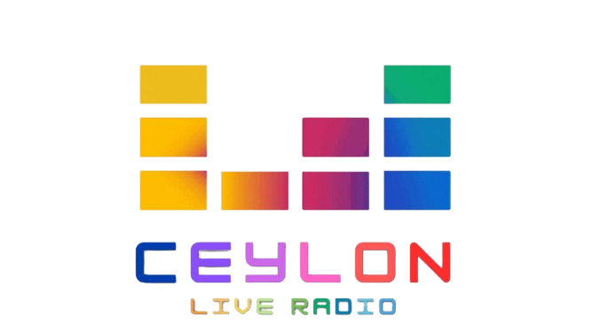

<p align="center">
  
</p>
<div align="center">
<a href="https://sh-y-zu.github.io/Ceylon-Live-FM-Radio/"><strong>➥ Live Demo</strong></a>
</div>
<br />
<br />
Welcome to Ceylon Live Radio, a simple website for streaming live FM radio stations from Sri Lanka!

## Overview

Ceylon Live Radio provides an easy-to-use platform for listening to your favorite FM radio stations from Sri Lanka. With a minimalist web UI, it's designed for simplicity and convenience.

## Features

- Stream live FM radio channels from Sri Lanka.
- Minimalist web UI for easy navigation.
- Easy-to-use interface, suitable for all users.

(Because I don't have enough knowledge to do anything more than this 😂)

## How to Use

1. Simply visit the website.
2. Browse through the list of available FM radio channels.
3. Click on a station to start streaming.

## Installation

To run the Live Radio Player locally on your machine, follow these steps:

1. Clone the repository:

    ```bash
    git clone https://github.com/sh-y-zu/Ceylon-Live-FM-Radio.git
    ```

2. Navigate to the project directory:

    ```bash
    cd Ceylon-Live-FM-Radio
    ```

3. Open the `index.html` file in your web browser.

## Contributing

Contributions are welcome! If you have any ideas for improvement or want to add new features, feel free to submit a pull request.

1. Fork the repository.
2. Create a new branch (`git checkout -b feature/your-feature`).
3. Make your changes and ensure they're properly tested.
4. Commit your changes (`git commit -m 'Add new feature'`).
5. Push to the branch (`git push origin feature/your-feature`).
6. Create a new Pull Request.

## License

This project is licensed under the [WTFPL License](LICENSE).


## Credits

- [Me](https://github.com/sh-y-zu) - Creator and maintainer of the Live Radio Player.

Enjoy listening to SriLankan FM Radio Channels! 🎶🌴

